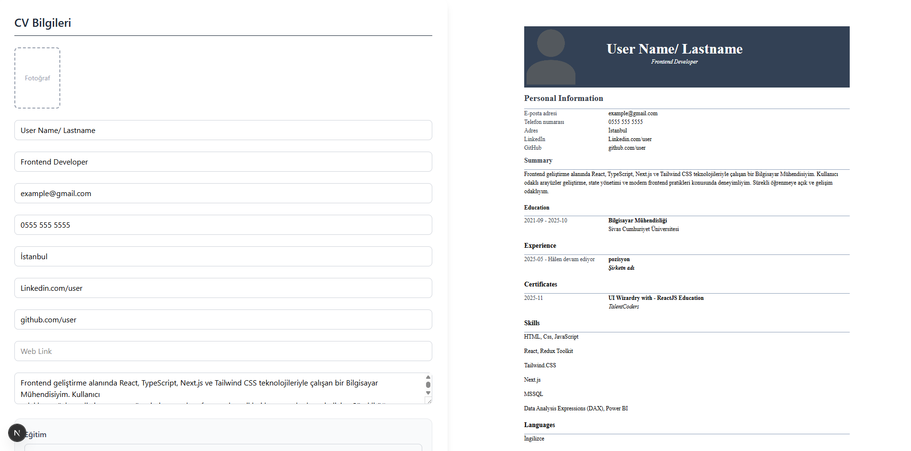
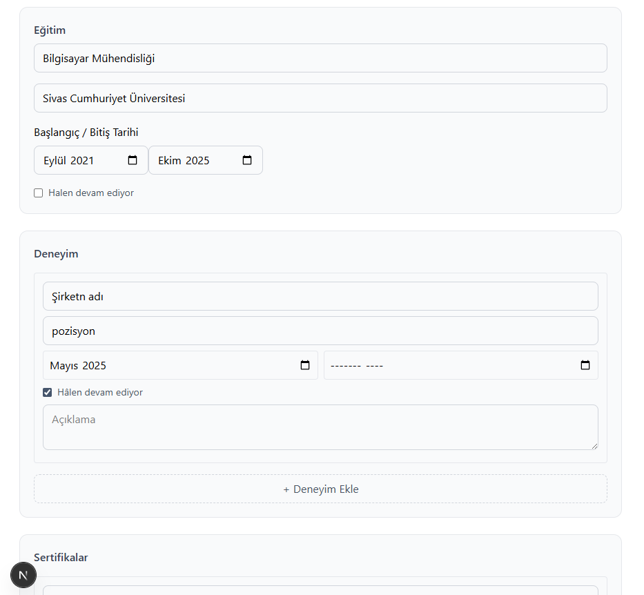
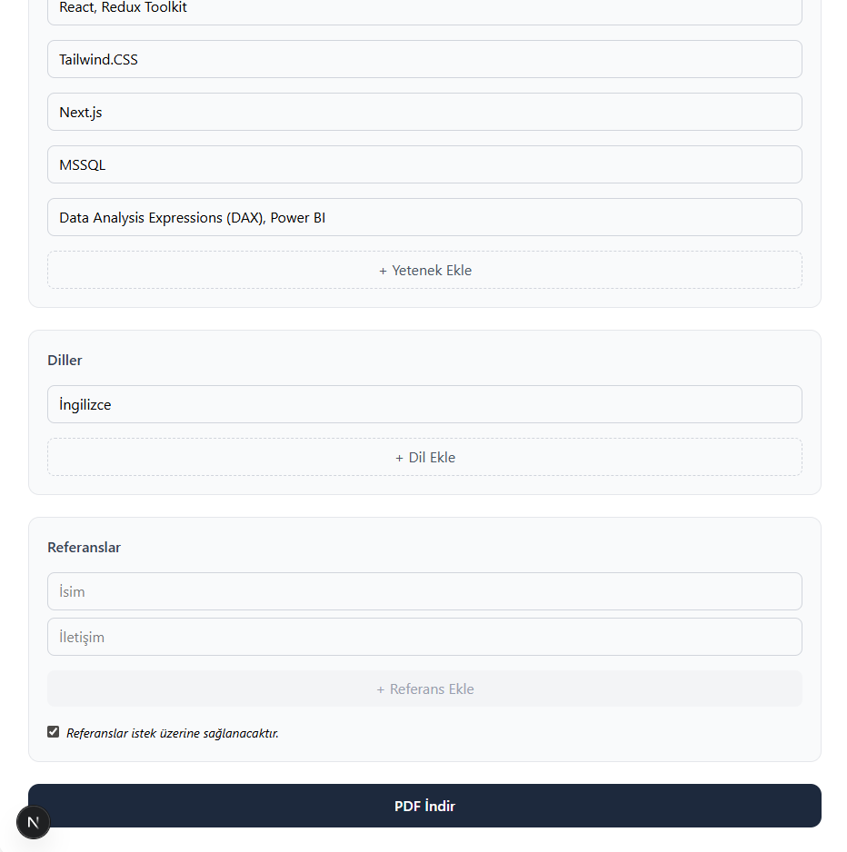
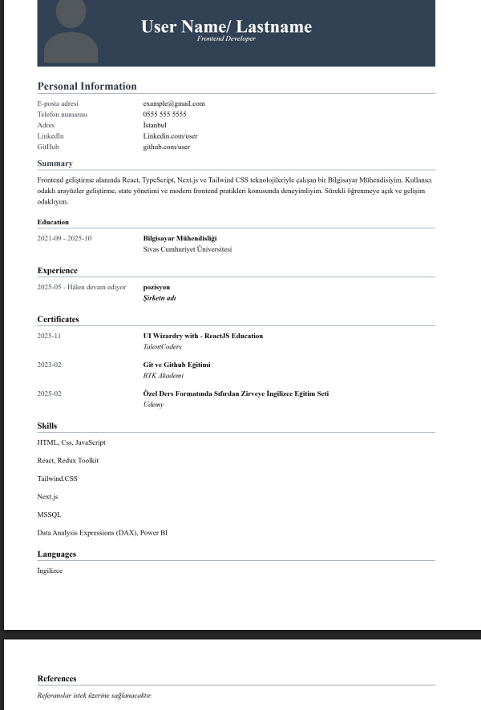

# 🧾 CV Oluşturucu (Resume Builder)

Bu proje, kullanıcıların web üzerinden kolayca CV oluşturup **canlı önizleme** ile görüntüleyebildiği ve **PDF olarak indirebildiği** modern bir CV oluşturma uygulamasıdır.

## 🚀 Özellikler

- 📝 Kişisel bilgiler girişi (Ad, pozisyon, iletişim bilgileri vb.)
- 🧑‍💼 Deneyim ekleme (çoklu, devam ediyor seçeneği ile)
- 🎓 Eğitim bilgileri
- 📜 Sertifikalar
- 🧠 Yetenekler
- 🌍 Diller
- 📎 Referanslar (istek üzerine seçeneği)
- 👀 Sağ tarafta **sticky canlı CV önizleme**
- 📄 CV’yi **A4 formatında PDF olarak indirme**
- 🎨 Modern ve sade tasarım (Tailwind CSS)

---

## 🛠 Kullanılan Teknolojiler

- **Next.js (App Router)**
- **React**
- **Tailwind CSS**
- **html2pdf.js**
- **html2canvas**

---

## 📸 Ekran Görüntüsü






---

## ⚙️ Kurulum

Projeyi kendi bilgisayarında çalıştırmak için:

```bash
git clone https://github.com/sevvalkarahan/CV_creation_page_with_next.js.git
cd resume_creation
npm install
npm run dev
```
